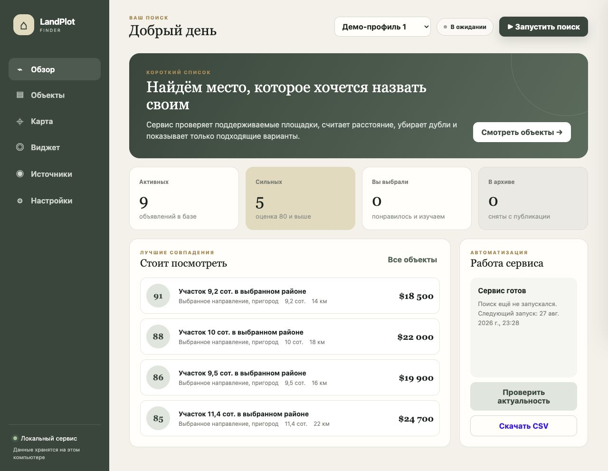
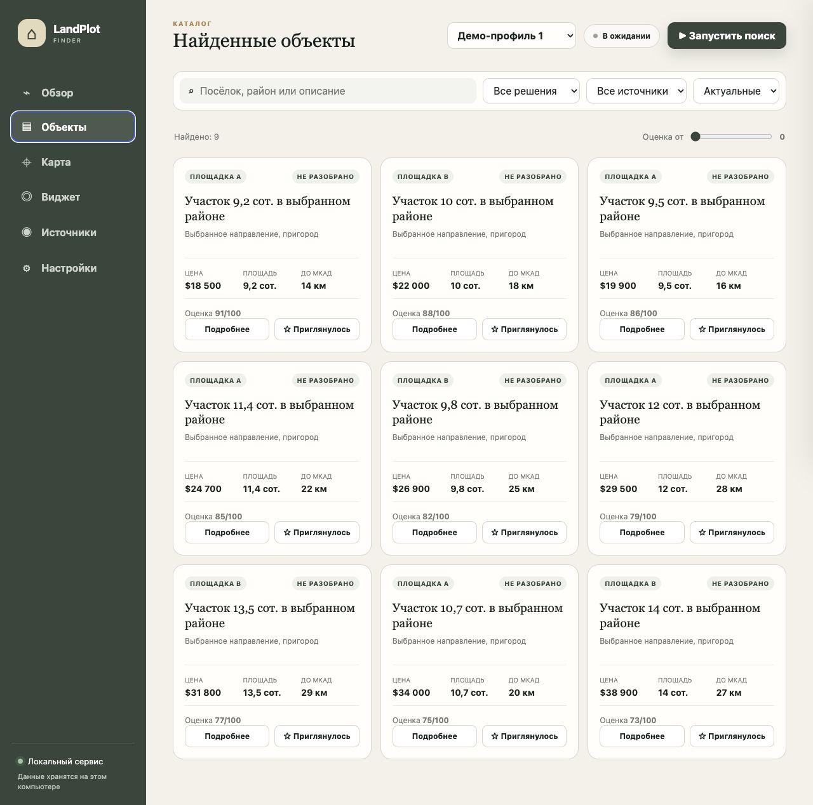
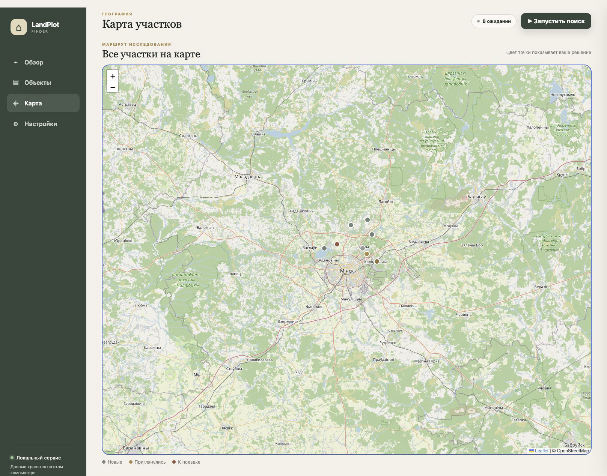
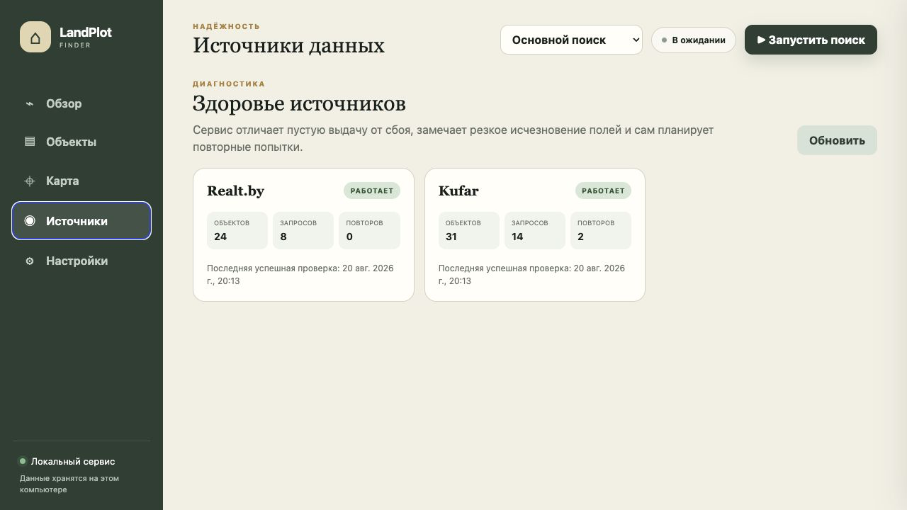
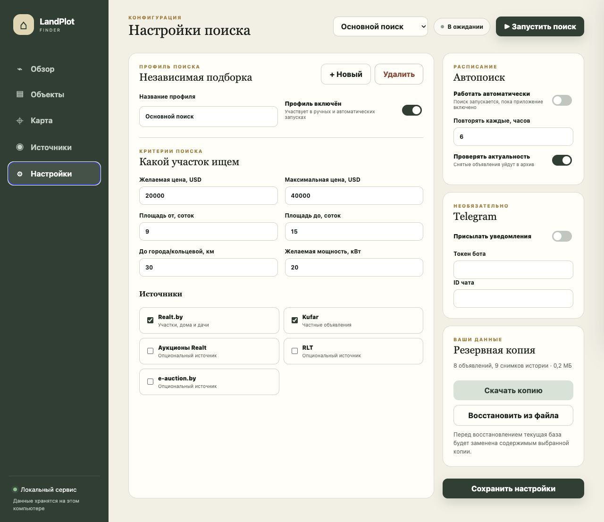

# LandPlotFinder

Автономное локальное приложение для поиска земельного участка на нескольких
площадках объявлений и электронных торгов. Оно загружает публичные карточки,
приводит данные к единому виду, отсеивает повторы, оценивает варианты и
показывает их в собственной веб-панели с каталогом, решениями, заметками и
картой. В публичной документации названия подключённых площадок обезличены.

Google Sheets, Google Cloud, Railway и PostgreSQL больше не обязательны.
Основной режим хранит всё в локальной SQLite. Telegram и прежняя синхронизация
Google Sheets сохранены как дополнительные интеграции для опытных пользователей.

Подробные критерии и принятые решения находятся в
[`REQUIREMENTS.md`](REQUIREMENTS.md).

## Установка для обычного пользователя

Скачайте готовый установщик со страницы
[Releases](https://github.com/IlyaBaikou/LandPlotFinder/releases):

- `LandPlotFinder-Windows-Setup-…exe` для Windows 10/11;
- `LandPlotFinder-macOS-…dmg` для macOS 11 и новее.

Python, Docker и терминал не нужны: установщик уже содержит Python и все
зависимости. После запуска откроется маленькое окно управления и браузер с
LandPlotFinder. Закрытие окна кнопкой «Остановить» корректно завершает фоновый
поиск. При первом запуске появится мастер настройки критериев и расписания.

Готовые установщики пока не подписаны коммерческими сертификатами. Поэтому
Windows может показать SmartScreen, а macOS — предупреждение о неизвестном
разработчике. Подробный безопасный порядок первого запуска описан в инструкции.

Для Linux и разработчиков остаётся запуск через Docker. Данные сохраняются
между обновлениями и переустановками.

Полная пошаговая инструкция: [`STANDALONE.md`](STANDALONE.md).

Для строительной компании доступен встраиваемый виджет: он показывает
накопленный каталог на сайте Tilda, открывает варианты после ввода кода,
показывает ссылки на исходные объявления и позволяет изучать их на карте,
сохранять и сравнивать на устройстве. В закрытом разделе панели менеджер видит
сохранённые номера посетителей. В демонстрационном режиме владение номером не
проверяется; для этого нужна SMS-отправка.
Посмотреть дизайн и возможности можно на
**[отдельной странице виджета](WIDGET.md)**, а готовый
HTML-блок и настройка находятся в **[инструкции для Tilda](docs/TILDA_WIDGET.md)**.

## Интерфейс

Главная показывает состояние сборщика, расписание, краткую статистику и
последние найденные варианты.



В каталоге можно отфильтровать объявления, открыть подробности, поставить
решение и сохранить заметку.



Все объявления с координатами доступны на общей карте — это удобно для
планирования поездки по приглянувшимся участкам. Объекты со статусом
«К поездке» автоматически упорядочиваются и открываются готовым маршрутом в
Google Maps или Яндекс Картах — сервис выбирается в настройках.



Экран источников показывает последний успешный обход, число карточек и
запросов, повторные попытки, ошибки и признаки изменения структуры сайта.



Можно создать до 20 независимых профилей поиска. У каждого профиля собственные
критерии, источники и расписание. В настройках также доступны скачивание и
восстановление полной резервной копии локальной базы.



## Надёжность и история

- временные сетевые ошибки повторяются с экспоненциальной паузой;
- после полного сбоя источника автоматически планируется до трёх отдельных
  повторов через 5, 10 и 20 минут;
- сервис запоминает обычный размер выдачи и полноту полей, поэтому может
  заметить исчезновение цен, площадей, координат или описаний после изменения
  сайта;
- карточка объявления показывает график цены и хронологию обновлений,
  архивирования, повторной публикации и ручных решений;
- резервная копия включает объявления, историю, решения, профили и настройки.

## Как устроен поиск

Фильтры площадок используются только как предварительный контур:

- цена до 40 000 USD для любого типа объекта;
- площадь 9–15 соток;
- расстояние не более 30 км от МКАД.

После загрузки приложение само присваивает статус:

- `MATCH` — строгие критерии подтверждены;
- `REVIEW` — данных недостаточно, нужна ручная проверка;
- `INTERESTING` — один из параметров немного выходит за строгую границу, но
  вариант всё равно заслуживает внимания;
- `REJECT` — объект находится вне широкого контура или имеет подтверждённый
  критический недостаток.

Цена, минимальная площадь и расстояние — жёсткие ограничения. Объекты с
известным выходом хотя бы за одну из этих границ получают `REJECT`.

Предпочтительные направления можно проверять дополнительной приоритетной
очередью. Она использует доступные географические фильтры площадок, но не
расширяет заданные границы цены, площади и расстояния. Объекты объединяются с
общей базой и получают пометку `ПРИОРИТЕТ`.

Если в карточке есть координаты, сервис считает расстояние по прямой до
ближайшего сегмента реального контура МКАД. Для точек внутри кольца
расстояние равно нулю. Контур хранится локально и основан на открытых
данных [OpenStreetMap](https://www.openstreetmap.org/copyright).

Недостающие коммуникации доизвлекаются из описания. Распознаются мощность и
расположение электричества, газ на участке или по улице, скважина, колодец,
центральная или сезонная вода, септик и канализация. Исходный фрагмент
сохраняется как доказательство; структурированное поле площадки имеет приоритет.

Аукционы ищутся в отдельных каталогах нескольких поддерживаемых электронных
площадок. Сторонние Telegram-агрегаторы не опрашиваются.

Завершённые торги не загружаются. Будущие лоты сохраняются как требующие
проверки: начальная цена может вырасти, а перед участием нужно проверить срок
подачи заявки, задаток, ограничения и условия оплаты. Цены в BYN переводятся
в USD по официальному курсу НБРБ на момент запуска. Для арестованного имущества
отдельно сохраняются кадастровый номер и опубликованные обременения.

Отдельный контур также проверяет категории домов и дач на площадках объявлений.
Старое строение рассматривается как альтернативный способ купить подходящий
участок, а не как повод увеличить бюджет. В таблице отдельно сохраняются тип
объекта, площадь и состояние дома, формат продажи, признаки юридических или
строительных рисков, ручное решение «сохранить / ремонт / снос» и оценка работ.

## Локальный пробный запуск

Нужен Python 3.9 или новее.

```bash
python3 -m venv .venv
source .venv/bin/activate
pip install -e '.[dev]'
cp .env.example .env
python -m app.cli check-config
python -m app.cli scan --dry-run --show 20
```

Пробный режим ничего не пишет в базу и таблицу и не отправляет уведомления.
Технические идентификаторы адаптеров доступны в интерфейсе и исходном коде,
но намеренно не перечисляются в презентационной документации.

## Google Sheets

1. Создать service account в Google Cloud и включить Google Sheets API.
2. Создать для него JSON-ключ.
3. Дать адресу service account права редактора на общую таблицу.
4. Передать весь JSON ключа одной строкой в
   `GOOGLE_SERVICE_ACCOUNT_JSON`.
5. Оставить `GOOGLE_SPREADSHEET_ID` из `.env.example`.

Сервис добавляет и обновляет только автоматически заполняемые поля листа
`Plots`. Статусы, ручные оценки пользователей, решение по старому дому, оценка
ремонта/сноса и другие ручные поля при повторном запуске не перезаписываются.
`Top` и лучший объект в `Dashboard` сначала используют автооценку сервиса.
Если заполнены ручные оценки критериев, они получают приоритет.

## Telegram

Для исходящих уведомлений webhook не нужен.

Пошаговая инструкция для новичка — от создания бота через BotFather до
проверочного сообщения: **[Настройка Telegram-бота](docs/TELEGRAM.md)**.

Коротко: создайте бота через BotFather, добавьте его в личный чат или группу,
получите ID чата и заполните поля **«Токен бота»** и **«ID чата»** в разделе
**Настройки → Telegram**. Токен нужно хранить как пароль и не публиковать в
репозитории или скриншотах.

Сервис отправляет один дайджест за запуск, а не отдельное сообщение на каждое
объявление. Аукционные карточки в Telegram не отправляются: они продолжают
сохраняться и обновляться только в PostgreSQL и Google Sheets.

Каждая Telegram-карточка явно помечается как `НОВОЕ` или `ОБНОВЛЕНО`, отдельно
показывает `ПЕРЕОПУБЛИКОВАНО` и `ВОЗМОЖНЫЙ ДУБЛЬ`, а для обновления перечисляет
изменившиеся поля. Заголовок ограничен коротким названием; переход на площадку
вынесен в отдельную ссылку `Открыть исходное объявление`, поэтому ошибочно попавшее
в заголовок длинное описание не раздувает дайджест.

Повторный ID того же источника не считается новой находкой. Если продавец
пересоздал объявление с новым ID, сервис объединяет его со старой записью
только при высокоуверенном совпадении площади, места и текста (а также
продавца, когда площадка отдаёт его ID). В этом случае строка в таблице
сохраняется, ссылка обновляется, а Telegram показывает тег
`ПЕРЕОПУБЛИКОВАНО`. Совпадения только по координатам или названию населённого
пункта автоматически не склеиваются: в одном СТ может продаваться несколько
похожих участков.

В раздел «Изменились» попадают изменения площади, ссылки, сроков аукциона и
накопленное изменение цены более чем на 5% относительно последней отправленной
карточки. Меньшие колебания цены сохраняются в базе и таблице, но не создают
Telegram-шум из-за пересчёта курса. Техническое обогащение карточки новыми
деталями также не создаёт повторное уведомление.

## Профили локаций

Команда `python -m app.cli enrich-locations` объединяет накопленные объявления
по населённым пунктам и садовым товариществам, пересчитывает предварительный
`Location Score` и создаёт лист `Locations`. В строках `Plots` профиль локации
добавляется в колонки `AV:BA`: оценка, вердикт, уверенность, положительные
сигналы и риски. Ручная колонка заметок на листе `Locations` не
перезаписывается.

Оценка строится по сохранённым объявлениям, коммуникациям, подъездным дорогам,
количеству домов и расстоянию. Дополнительный контур загружает широкие выдачи
домов от заданного порога на поддерживаемых площадках и использует их как сигнал сложившейся
коттеджной застройки. По координатам небольшой ротационной пачки локаций он
также проверяет OpenStreetMap: магазины, общественный транспорт, школы,
детские сады и медицину рядом. Результаты хранятся с TTL и переиспользуются,
поэтому запросы не выполняются отдельно для каждого нового участка.

По умолчанию каталоги дорогих домов обновляются не чаще раза в 12 часов,
наблюдения сохраняются на 45 дней, а OSM проверяет 12 требующих обновления
локаций за проход и возвращается к ним через 14 дней. Недоступность внешнего
источника останавливает только обогащение, но не основной поиск и Telegram.
Кадастр, генпланы и экологические ограничения оставлены для следующего этапа.
До их подключения профиль не считается окончательной проверкой локации.

Пауза между запросами по умолчанию составляет 3 секунды. Уменьшать её не
рекомендуется: площадки могут ограничивать слишком частые обращения.
Детальные карточки обрабатываются ротационными сериями: сервис делает
паузу между сериями, при HTTP 429 ждёт и повторяет запрос, а на следующем
запуске берёт другую часть карточек. Новые объявления имеют первый приоритет,
затем обрабатываются ранее отложенные уведомления и старые карточки без
расстояния. Новая карточка сохраняется в таблице сразу, но не отправляется в
Telegram, пока сервис не загрузит её детальную страницу. Это постепенно
обогащает всю выдачу и не пытается обходить защиту площадки.

## Запуск с сохранением

После настройки PostgreSQL, Google Sheets и Telegram:

```bash
python -m app.cli scan --persist
```

До завершения первой проверки рекомендуется оставлять `DRY_RUN=true`.

## Telegram и маршруты

Каждый новый или существенно обновлённый объект отправляется отдельной
Telegram-карточкой. Кнопка `⭐ Приглянулось` меняет ручной статус строки в
`Plots` на `Изучаем` и сразу пересобирает вкладку `Trips`. В `Trips` находятся
отдельные точки и готовые ссылки на автомобильные маршруты Google Maps;
мобильный маршрут содержит не более четырёх участков.

Бот также принимает `/trip` для выдачи актуальных маршрутов. Объявление,
найденное вручную, можно добавить командой `/add <ссылка>` или ответом со
ссылкой на сообщение бота. Это работает без отключения privacy mode в группе.
Webhook проверяет секретный заголовок Telegram и принимает действия только из
настроенной семейной группы.

Повторную подборку лучших ещё не выбранных строк можно запустить отдельно:

```bash
python -m app.cli send-catalog --min-score 80 --limit 48
```

Карточки помечаются как `СТАРТОВАЯ ПОДБОРКА` и отправляются с безопасной
паузой, чтобы не превышать групповой лимит Telegram.

## Актуальность объявлений

Команда `python -m app.cli check-activity` проверяет ранее найденные активные
объявления небольшими ротационными пачками. HTTP 404/410 или
структурный признак снятой карточки считается первым подтверждением; строка
получает статус `Архив` только после двух последовательных подтверждений.
CAPTCHA, HTTP 403/429, таймаут и неизвестная структура страницы не архивируют
объект. Архивные строки остаются в истории, но исключаются из `Top`, повторной
Telegram-подборки и последующих проверок.

## Railway

Проект уже содержит `Dockerfile` и `railway.toml`. Railway запускает постоянный
веб-сервис, а встроенный планировщик обновляет каждый включённый профиль с его
собственной периодичностью. Отдельный Railway Cron для этого режима не нужен.

1. Создать Railway-проект из GitHub-репозитория.
2. Добавить PostgreSQL и использовать его `DATABASE_URL`.
3. Заполнить переменные из `.env.example` и создать публичный домен.
4. Открыть веб-панель и завершить первоначальную настройку.
5. Сначала проверить ручной поиск, затем включить расписание нужных профилей.

Для публичного виджета обязательно задайте пароль панели, секрет телефонных
сессий и разрешённые домены. Полная схема развёртывания, SMS и передачи лидов
в CRM описана в **[инструкции для Tilda](docs/TILDA_WIDGET.md)**.
Панель открывает собственную страницу входа по `ADMIN_USERNAME` и
`ADMIN_PASSWORD`; системное окно Basic Auth пользователю больше не требуется.

Для безопасной демонстрации панели заказчику можно дополнительно задать
`VIEWER_USERNAME` и `VIEWER_PASSWORD`. Эта учётная запись получает только
просмотр: сервер блокирует изменение настроек и статусов, запуск задач, экспорт
и скачивание резервной копии. Телефоны лидов, исходные ссылки, точные координаты,
адреса, заметки и тексты объявлений в таком режиме обезличиваются. Полная
администраторская учётная запись продолжает работать независимо.

Если внешняя площадка возвращает CAPTCHA, HTTP 403 или длительный HTTP 429,
сервис не пытается обходить ограничение и отмечает источник ошибкой.
Данные инфраструктуры получаются через публичные экземпляры Overpass API:
© участники OpenStreetMap, ODbL.

## Проверки

```bash
pytest
ruff check .
```
