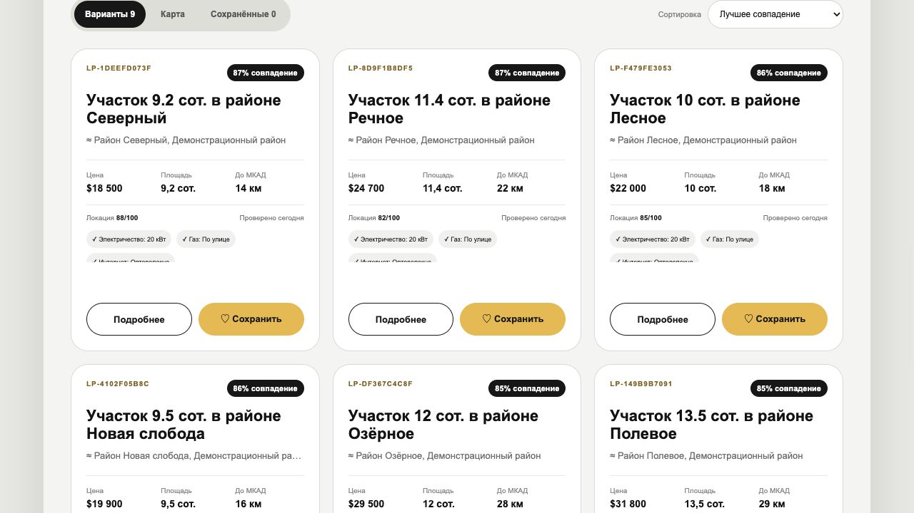
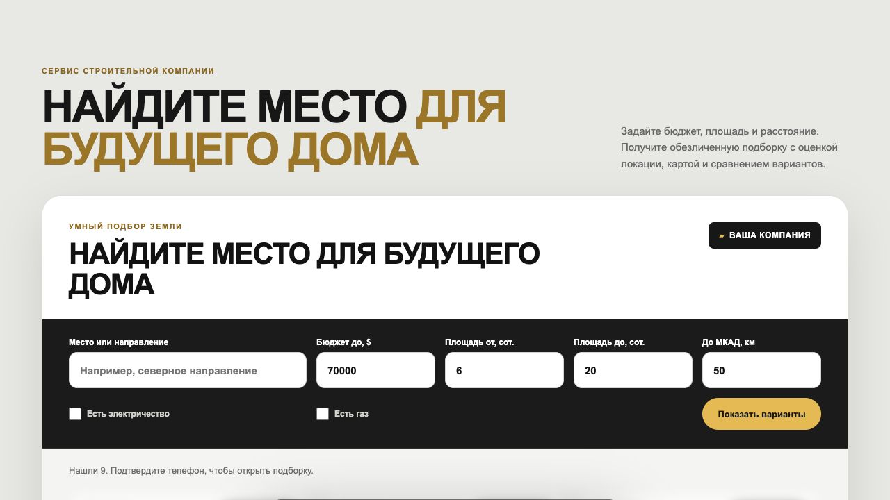
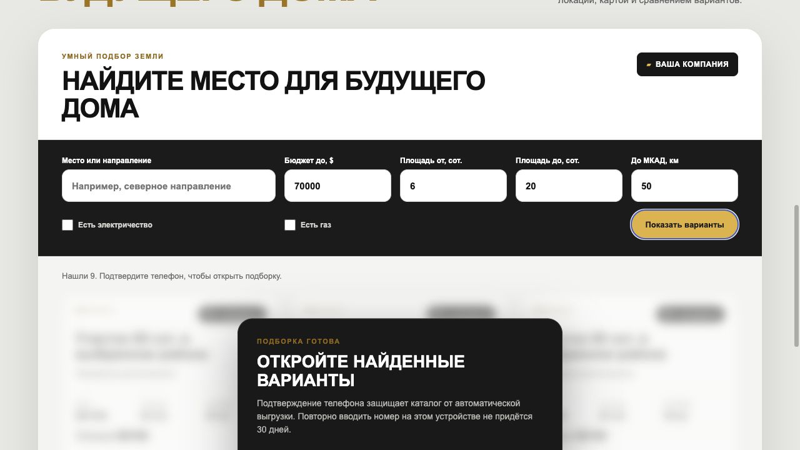
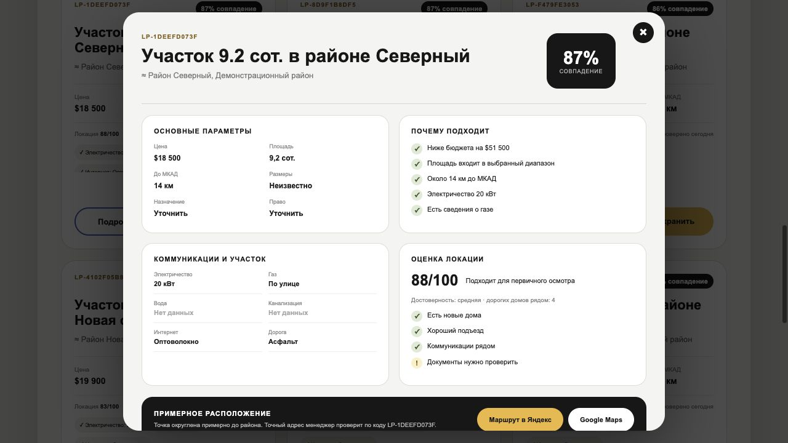
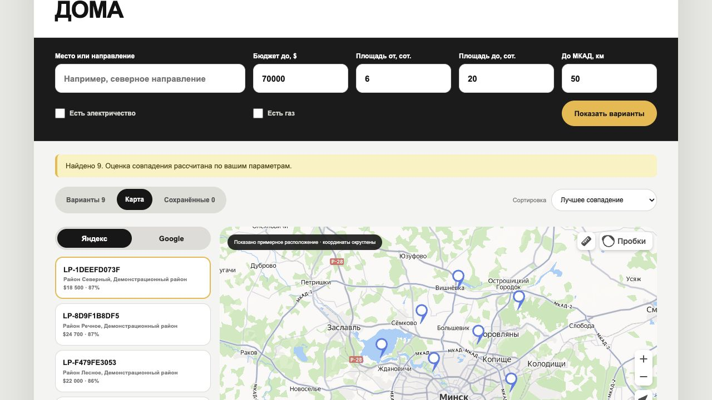
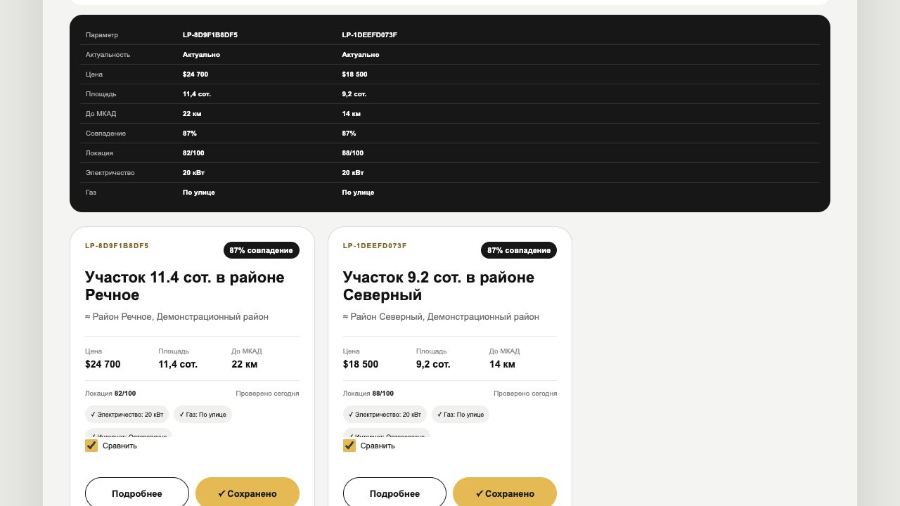

# LandPlotFinder Widget для строительной компании

Встраиваемый каталог земельных участков для сайта строительной компании.
Посетитель сначала задаёт параметры будущего участка. После поиска он видит
число найденных вариантов и безопасный размытый preview, подтверждает телефон,
изучает обезличенные варианты на карте, сравнивает их и сохраняет понравившиеся
на своём устройстве.

Фоновый сборщик несколько раз в день обновляет общую базу. Поиск посетителя
работает только по уже сохранённым данным и не запускает отдельный обход
внешних площадок.

[Техническая инструкция для Tilda, Railway, SMS и CRM](docs/TILDA_WIDGET.md)

## Как это выглядит на сайте

Презентационная версия использует нейтральный образ вымышленной строительной
компании: чёрно-белые контрастные блоки, жёлтый акцент, крупные заголовки и
округлые элементы интерфейса. Реальные бренды, телефоны и домены в демо не
используются.



## Все экраны виджета

### 1. Параметры поиска

Направление выбирается из готового списка — произвольный текст в фильтр не
попадает. Кроме электричества и газа посетитель может потребовать наличие
водоснабжения и канализации.



### 2. Найденные варианты и подтверждение телефона

Телефон запрашивается только после первого поиска. Карточки размыты, а их
полные данные и ссылки ещё не загружены в браузер.



### 3. Одноразовый код

В демо-режиме индивидуальный код показан прямо в окне, рядом есть кнопка
копирования. Для подтверждения владения номером требуется SMS-режим.

### 4. Персональная подборка

Оценка совпадения пересчитывается по параметрам конкретного посетителя.
Отдельно показывается качество локации. Карточки имеют одинаковую высоту.


### 5. Детали, карта и похожие варианты

Внутри виджета доступны коммуникации, возможные риски, объяснение оценки,
примерная карта и маршруты. Яндекс Карты используются по умолчанию, Google
Maps доступны как альтернатива. Назначение земли (включая ЛПХ) и вид права на
землю показываются отдельными строками и не смешиваются между собой.



В карточке есть ссылка на исходное объявление с фотографиями. Отдельная кнопка
**«Интересен этот участок»** явно отмечает вариант для менеджера; простое
открытие объявления или сохранение в браузере интересом не считается.



### 6. Сохранение и сравнение

Понравившиеся варианты сохраняются только в `localStorage` браузера. Их можно
сравнить по цене, площади, расстоянию, коммуникациям и оценке локации. При
открытии виджет сверяет с сервером их анонимные коды `LP-…`. Снятая с
публикации карточка остаётся в списке для истории, получает заметную отметку и
не показывает активную ссылку на объявление.



### 7. Мобильная версия


## Панель менеджера

Закрытый раздел показывает номера посетителей, которые ввели код, последние
условия поиска и участки, отмеченные отдельной кнопкой. В демо-режиме это не
подтверждает владение номером. Отправка лидов в Telegram менеджеру пока не
подключена по умолчанию. Отдельный бот виджета можно включить переменными
`WIDGET_TELEGRAM_BOT_TOKEN` и `WIDGET_TELEGRAM_CHAT_ID`: уведомление придёт
только при явной отметке участка клиентом.

Для демонстрации тот же Telegram-бот может отправлять клиенту актуальные
объявления по его фильтрам и ежедневную подборку новых совпадений после явной
подписки. Позже его заменит корпоративный бот без переноса базы клиентов.
Сценарий подключения, согласия и отписки описан в
[CLIENT_TELEGRAM_BOT.md](docs/CLIENT_TELEGRAM_BOT.md).

При заданном `ADMIN_PASSWORD` адрес панели автоматически открывает отдельную
страницу входа. Логин берётся из `ADMIN_USERNAME` (по умолчанию `admin`), после
успешного входа браузер получает защищённую сессионную cookie на 7 дней.
Панель можно оформить в стиле партнёра: `ADMIN_BRAND=liderstroy` включает
тему «ЛидерСтрой». Без этой настройки standalone-приложение остаётся в
нейтральном оформлении LandPlotFinder; логика и доступы не меняются.

Это самостоятельный демонстрационный концепт интеграции. Название компании и
контакты вымышлены.

## Сценарий посетителя

1. Посетитель задаёт бюджет, площадь, расстояние от МКАД и коммуникации.
2. Нажимает **«Показать варианты»** и видит количество найденного и размытые
   карточки без раскрытия данных.
3. Вводит телефон, принимает условия и подтверждает номер шестизначным кодом.
4. Получает лучшие варианты из актуального каталога без повторного поиска.
5. Изучает детали и примерное расположение, открывает маршрут в Яндекс Картах
   или Google Maps.
6. Сохраняет и сравнивает варианты на своём устройстве. По анонимному коду
   менеджер может найти исходное объявление в закрытой панели.
7. При желании открывает исходное объявление и смотрит фотографии на площадке.
8. Если конкретный участок заинтересовал, нажимает **«Интересен этот участок»**.
   Только эта отметка привязывает объявление к его номеру в панели менеджера.

Только SMS-режим подтверждает владение номером и помогает отсечь простых ботов;
демо-код на экране этого не делает.
Даже до подключения SMS действуют лимиты на запросы кодов, приглашений в бота
и объём просмотра каталога; подробности — в [инструкции по развёртыванию](docs/TILDA_WIDGET.md).

## Что получает строительная компания

- новый источник целевых лидов на раннем этапе выбора участка;
- сохранённый номер, страницу входа и UTM-метки;
- возможность предложить оценку участка, проект дома и строительство;
- список посетителей, последние фильтры и отмеченные участки в разделе
  **«Клиенты»**;
- передачу события входа в CRM через webhook, если он настроен;
- собственный регулярно обновляемый каталог без зависимости интерфейса от
  Google Sheets;
- защищённую паролем панель со списком объявлений и лидов.

## Как устроен сервис

```text
Поддерживаемые внешние площадки
      ↓  фоновое обновление по расписанию
LandPlotFinder + PostgreSQL
      ↓  безопасный публичный API
Виджет на Tilda
      ↓  телефон + подборка со ссылками на источники
CRM / менеджер строительной компании
```

Поиск на сайте не обращается к площадкам недвижимости напрямую. Это позволяет
контролировать частоту фоновых запросов, не создавать всплески нагрузки и
быстро отвечать посетителям из собственной базы.

## Защита и контакты

- код действует 10 минут;
- повторная отправка доступна через минуту;
- не более пяти кодов в час на один номер;
- не более пяти попыток проверки одного кода;
- на устройстве хранится только непрозрачный токен, но не телефон или код;
- сохранённые участки хранятся только в `localStorage` этого браузера;
- сервер получает анонимные коды сохранённых карточек для проверки их
  актуальности и последние условия поиска после входа;
- сохранение и сравнение не создают заявку менеджеру, явная отметка интереса
  записывается на сервере;
- подтверждённая сессия действует 30 дней и не требует повторного ввода номера;
- основная панель закрывается отдельным паролем;
- публичный API можно ограничить доменами компании;
- в списке лидов показываются номера после успешного ввода кода (в режиме
  `demo` это не подтверждение владения номером).

Полные объявления не загружаются в браузер до подтверждения: публичный preview
возвращает только количество карточек. В демонстрационном режиме код появляется
на экране. Для публикации подключается реальная SMS-отправка через webhook,
Make, n8n или адаптер выбранного SMS-провайдера.

После ввода кода публичный API не отдаёт оригинальные заголовки, описания,
фотографии и внутренние ID, но отдаёт ссылку на исходное объявление. Координаты
на карте виджета округляются, а каждый вариант получает код вида
`LP-A1B2C3D4E5`.

## Встраивание

На Tilda виджет добавляется одним блоком T123:

```html
<div id="landplotfinder-widget"></div>
<script
  src="https://ВАШ-БЭКЕНД/static/landplotfinder-widget.js"
  data-target="landplotfinder-widget"
  data-company-name="ВАША КОМПАНИЯ"
  data-accent="#ffb434"
  data-map-provider="yandex"
  data-results-height="680"
  data-privacy-url="https://example.by/privacy">
</script>
```

Название, акцентный цвет, начальные границы цены, площади и расстояния задаются
атрибутами блока. Сам backend можно держать на Railway с PostgreSQL и встроенным
планировщиком обновления каталога.

В Zero Block скрипт автоматически подстраивает высоту блока, а длинная выдача
прокручивается внутри виджета. Высоту области выдачи можно изменить через
`data-results-height` (420–1000 пикселей). В обычном T123 остаётся естественная
высота без внутренней прокрутки.

Полная настройка находится в
**[пошаговой инструкции](docs/TILDA_WIDGET.md)**.
