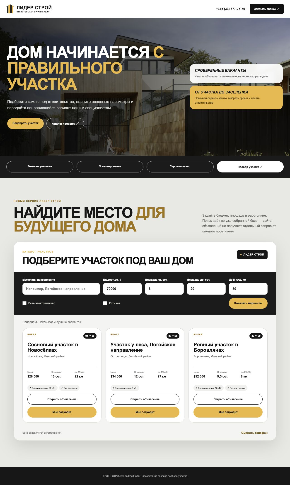
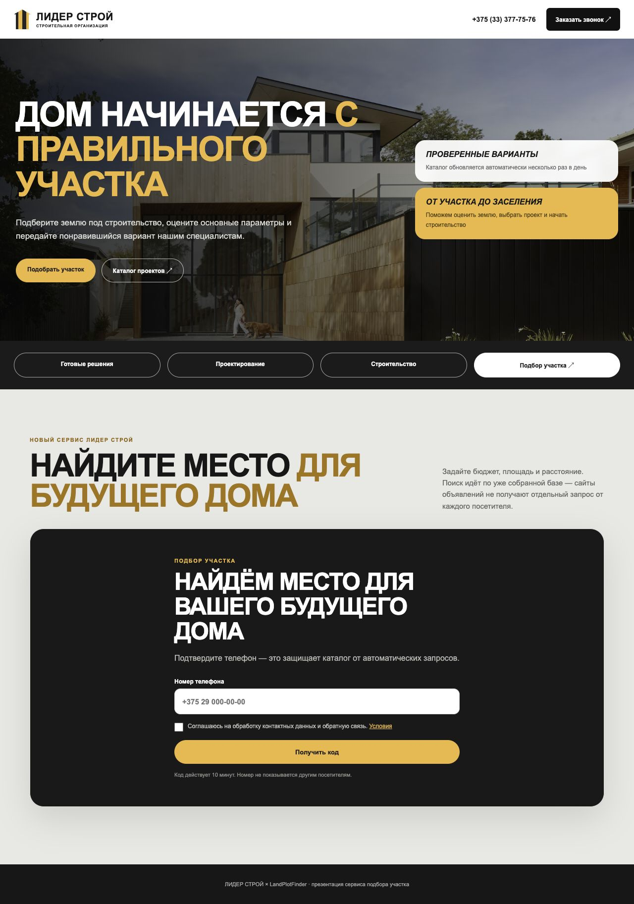

# LandPlotFinder Widget для строительной компании

Встраиваемый каталог земельных участков для сайта строительной компании.
Посетитель подтверждает телефон, задаёт параметры будущего участка, изучает
подходящие объявления и одним нажатием передаёт выбранный вариант специалисту.

Фоновый сборщик несколько раз в день обновляет общую базу. Поиск посетителя
работает только по уже сохранённым данным и не запускает отдельный обход Realt
или Kufar.

[Техническая инструкция для Tilda, Railway, SMS и CRM](docs/TILDA_WIDGET.md)

## Как это выглядит на сайте

Презентационная версия оформлена в визуальном стиле сайта Lider Stroy:
чёрно-белые контрастные блоки, фирменный жёлтый акцент, крупные заголовки и
округлые элементы интерфейса.



До открытия каталога посетитель подтверждает номер одноразовым кодом:



Это самостоятельный демонстрационный концепт интеграции, а не опубликованная
страница официального сайта компании.

## Сценарий посетителя

1. Посетитель открывает подбор участков на сайте компании.
2. Вводит телефон, принимает условия обработки данных и подтверждает номер
   шестизначным кодом.
3. Задаёт бюджет, площадь, расстояние от МКАД и необходимые коммуникации.
4. Получает лучшие варианты из актуального каталога.
5. Нажимает **«Мне подходит»** на заинтересовавшем участке.
6. Компания получает подтверждённый телефон, параметры поиска, выбранное
   объявление, страницу входа и UTM-метки.

Подтверждение телефона доказывает владение номером и отсекает простых ботов,
но не является полной юридической идентификацией личности.

## Что получает строительная компания

- новый источник целевых лидов на раннем этапе выбора участка;
- контекст вместо одного телефонного номера: бюджет, площадь, направление и
  конкретный понравившийся объект;
- возможность предложить оценку участка, проект дома и строительство;
- передачу заинтересованного клиента в CRM через webhook;
- собственный регулярно обновляемый каталог без зависимости интерфейса от
  Google Sheets;
- защищённую паролем панель со списком объявлений и лидов.

## Как устроен сервис

```text
Realt / Kufar
      ↓  фоновое обновление по расписанию
LandPlotFinder + PostgreSQL
      ↓  безопасный публичный API
Виджет на Tilda
      ↓  телефон + выбранный участок
CRM / менеджер строительной компании
```

Поиск на сайте не обращается к площадкам недвижимости напрямую. Это позволяет
контролировать частоту фоновых запросов, не создавать всплески нагрузки и
быстро отвечать посетителям из собственной базы.

## Защита и контакты

- код действует 10 минут;
- повторная отправка доступна через минуту;
- не более пяти кодов в час на один номер;
- не более пяти попыток проверки одного кода;
- подтверждённая сессия действует 24 часа в текущей вкладке;
- основная панель закрывается отдельным паролем;
- публичный API можно ограничить доменами компании;
- в списке лидов показываются только подтверждённые телефоны.

В демонстрационном режиме код появляется на экране. Для публикации подключается
реальная SMS-отправка через webhook, Make, n8n или адаптер выбранного
SMS-провайдера.

## Встраивание

На Tilda виджет добавляется одним блоком T123:

```html
<div id="landplotfinder-widget"></div>
<script
  src="https://ВАШ-БЭКЕНД/static/landplotfinder-widget.js"
  data-target="landplotfinder-widget"
  data-company-name="ЛИДЕР СТРОЙ"
  data-accent="#ffb434"
  data-privacy-url="https://lider-stroy.by/politika_konfidencialnosti">
</script>
```

Название, акцентный цвет, начальные границы цены, площади и расстояния задаются
атрибутами блока. Сам backend можно держать на Railway с PostgreSQL и встроенным
планировщиком обновления каталога.

Полная настройка находится в
**[пошаговой инструкции](docs/TILDA_WIDGET.md)**.

